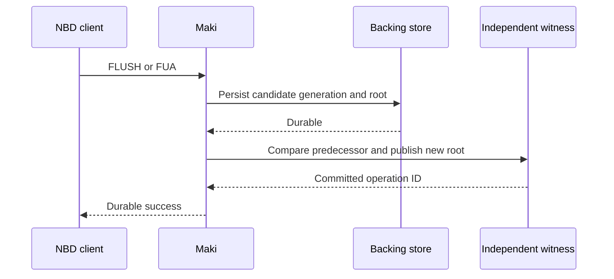

# Rollback protection proposal

Status: design recommendation, 2026-09-20. This document does not describe an
implemented protection. V2 and V3 volumes still cannot detect every restoration
of an older, internally valid volume image or ciphertext for the same unit.

## Recommended boundary

Use an authenticated volume root anchored in an independent, strongly
consistent witness. Keep durable generations of data and metadata until the
witness commits their root. Implement this as a new, explicitly selected
format and durability mode; do not reinterpret existing volumes on attach.

A counter, MAC, signed checkpoint, hash chain, or Merkle root stored only in the
backing directory can be restored together with that directory. TLS protects a
connection but does not establish that an otherwise valid stored image is the
latest one. The freshness reference must survive independently of the backing
snapshot and must not share its restore procedure or deletion authority.

This is Maki's proposed design. Distributed storage work such as
[SUNDR](https://www.usenix.org/conference/osdi-04/secure-untrusted-data-repository-sundr)
also distinguishes authenticated contents from consistency across clients; its
fork-consistency detection depends on clients observing each other's changes.
For Maki's first implementation, an online witness gives a more direct rule for
accepting a durable generation than periodically comparing client histories.

## State to authenticate

The witness stores one current record per volume:

```text
volume UUID, format identity, epoch, writer fencing token,
durable sequence, authenticated root, commit operation ID
```

Each tree leaf binds the volume and epoch, unit index, unit generation,
allocation/discard state, and a hash of the exact ciphertext representation.
Internal nodes have distinct encodings from leaves. A discard is an explicit
authenticated zero state; a missing node or slot is an error, never an inferred
zero. Geometry and provider compatibility identity are also bound by the root.
The encoding and hash construction need fixed test vectors before implementation.

Reads verify the selected leaf and path against the witnessed root, or the
active writer's explicitly tracked pending generation. Replacing an old slot
alone then fails its leaf hash; restoring a whole older tree fails comparison
with the witness. Ordinary provider AEAD remains useful but is not a substitute
for this freshness check.

The witness must authenticate clients and responses, reject a decreasing epoch
or sequence, and atomically compare the expected predecessor with the new
record. A request ID makes retries identifiable. A witness restored to an old
backup without an independent recovery procedure defeats this design.

## Durable barrier protocol

The extra round trip belongs on successful FLUSH/FUA completion. Ordinary
non-FUA writes retain their existing volatile-write contract. Group commit can
amortize a witness transaction over a barrier's captured durable horizon.

1. Capture a fixed horizon and prepare its new data generation and tree.
2. Persist the generation, journal/manifest, and necessary directory entries.
   Retain everything needed to read the previous witnessed root.
3. Atomically advance the witness from the expected predecessor to the new
   `(epoch, fencing token, sequence, root, operation ID)`.
4. Confirm the witness result before completing the durable barrier.
5. Reclaim unreachable data only after it is no longer needed by the committed
   root, pending commits, readers, or the retained recovery generation.



| Failure point | Required behavior |
|---|---|
| Local persistence fails | Do not advance the witness or return durable success. |
| Witness request fails before commit | Retain the predecessor and candidate; do not acknowledge durability. |
| Witness response is lost | Strongly read the operation ID/root to resolve the outcome; never assume failure and roll back the witness. |
| Witness commits, client reply is lost | Recovery selects the committed root; the client may retry its operation. |
| Witness is ahead of available local data | Refuse attachment and restore the exact committed generation; do not lower the witness. |
| Local storage has an uncommitted newer candidate | Recover from the witnessed root; discard or explicitly recommit the candidate under a fresh valid writer token. |
| Witness cannot be contacted at attach | Refuse writable readiness. Any offline access must be an explicitly separate mode without a freshness claim. |

## Required storage work

Current checkpoints overwrite fixed slot locations. Those writes can destroy
the previous root's data before a witness transaction completes. Adding a
counter update after today's checkpoint therefore does not make the protocol
above recoverable. A new format needs copy-on-write slots, immutable extents,
or a retained redo/undo generation that can serve the prior root until commit.
Its metadata and garbage collector must follow the same rule.

The V3 discard map is replicated crash metadata, not an authenticated tree.
Physical punching in a rollback-protected format must wait until no retained
root refers to the extent. Current discard ordering remains unchanged until
such a format is designed and qualified separately.

A writer session also needs an exclusive fencing token checked by every witness
commit. A superseded writer must stop serving its session; CAS on the witness
alone does not stop it overwriting in-place data or serving stale reads. The
first release should keep one writer and use immutable candidate generations,
with explicitly tested session revocation and reconnect behavior.

## Witness service and restoration

Use an existing trusted transactional service if one is available independently
of the backing. On GCP, a small witness service backed by Spanner serializable
read/write transactions and strong reads is one candidate: its documented
[external consistency](https://docs.cloud.google.com/spanner/docs/true-time-external-consistency)
and [transaction semantics](https://docs.cloud.google.com/spanner/docs/transactions)
can support the predecessor comparison. This is an architectural option, not a
deployment or cost decision; no witness resources have been created.

Restoring an older backup is an explicit administrative operation. Prefer a new
volume UUID with its own witness record and a recorded parent snapshot. If the
same logical volume must continue, advance to a new epoch under a controlled
restore protocol that revokes old writer tokens. Never expose an automatic
"accept older sequence" recovery switch.

Witness availability becomes part of durable-write availability. Returning
local-only durable success during a witness outage would create a rollback
window and must not be described as full rollback prevention. A deployment
choosing that tradeoff needs a separately named weaker mode.

## Implementation gates

Before production support, test same-unit old ciphertext, old discard state,
whole-volume image restoration, lost witness responses, every local/witness
commit boundary, conflicting writers, revoked sessions, missing committed
extents, and explicit backup restoration. The crash oracle must keep its ACK
ledger and witness outside the tested volume. Test that no acknowledged
generation disappears and that missing evidence stops readiness.

The next implementation step is a model of the commit/recovery protocol and
new-format storage design.
